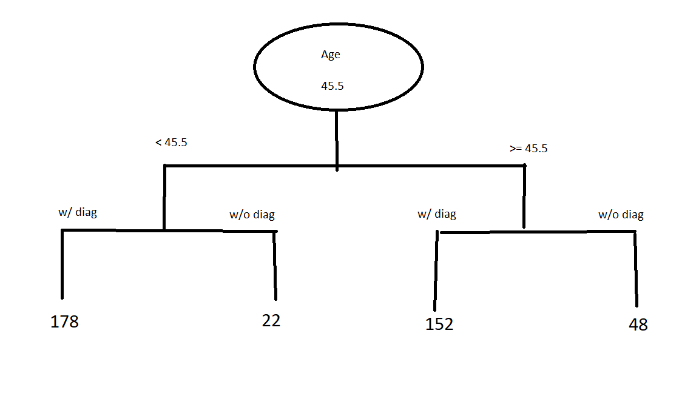

```{r packages}
library(ggplot2)
library(readxl)
library(caret)
library(gains)
library(rpart)
library(rpart.plot)
library(pROC)
library(randomForest)
library(adabag)
```

# WARNING: If you're using a version of R that is 3.6 or larger, then Connect is going to mark your answers as incorrect, even if they are correct. This is because R updated the way they generate random numbers, so the set.seed() function generates different random numbers than the version of R used in the textbook. Since these problem set grades do not factor into the final grade, don't worry about this. We will use the new random numbers, so the Connect solutions will be different.

### 10.1

```{r 10.1data}
myData = read_xlsx("Ch10_Q1_Data_File.xlsx")
```

To calculate min and max split values, sort by the respective variable and then average out the two largest and two smallest pairs of observations.
```{r 10.1}
agesort = order(myData$Age)
myDataAge = myData[agesort,]
mean(myDataAge$Age[7:8])
mean(myDataAge$Age[1:2])
incsort = order(myData$Income)
myDataInc = myData[incsort,]
mean(myDataInc$Income[7:8])
mean(myDataInc$Income[1:2])
```


### 10.2



At root node, there are 330 (178+152) observations with a diagnosis and 70 (22+48) observations without a diagnosis. Thus, the Gini index is calculated as such:
```{r 10.2a}
1 - ((70/400)^2+(330/400)^2)
```

At the $Age<45.5$ partition, there are 178 observations with a diagnosis and 22 observations without a diagnosis. Thus, the Gini index is calculated as such:
```{r 10.2b}
1 - ((22/200)^2+(178/200)^2)
```

At the $Age\geq45.5$ partition, there are 152 observations with a diagnosis and 48 observations without a diagnosis. Thus, the Gini index is calculated as such:
```{r 10.2c}
1 - ((48/200)^2+(152/200)^2)
```

For the split, there are 200 observations on either side of the age split. Thus, we weight each of the partition's Gini index by 0.5 (200/400).
```{r 10.2d}
0.5*(1 - ((22/200)^2+(178/200)^2)) + 0.5*(1 - ((48/200)^2+(152/200)^2))
```


### 10.3

```{r 10.3data}
myData = read_xlsx("Ch10_Q9_Data_File.xlsx")
myScoreData = read_xlsx("Ch10_Q9_Score_File.xlsx")
```

a.

First, save $y$ as factor. Then partition data. The rpart function generates the default classification tree and prp plots the outputted tree. The "class" method is the default for a factor variable, so technically not necessary. The summary of the tree outputs the details for each node in the tree (note: the node numbers jump from 7 to 12, because there are no children to nodes 4 or 5, but those are labeled as 8-11 internally).
```{r 10.3a}
myData$y <- as.factor(myData$y)
set.seed(1)
myIndex <- createDataPartition(myData$y, p=0.7, list=FALSE)
trainSet <- myData[myIndex,]
validationSet <- myData[-myIndex,]
set.seed(1)
default_tree <- rpart(y~., data = trainSet, method = "class")
summary(default_tree)
prp(default_tree, type = 1, extra = 1, under = TRUE)
```

With this default tree, we have 5 terminal leaf nodes. The root split is for $x_5$ at 15.82 (the figure rounds up to 16 and the solution in Connect splits at 20).

b.

To build the full tree, we need to insert a few options to the rpart function. First, the cp=0 sets the threshold for the complexity parameter to 0. This means that if a split provides *any* additional benefit ($>cp$), it will be included in the tree. This complexity parameter controls the amount of *pruning* for the tree. In other words, if a split does not add any meaningful benefit in terms of predictive performance (determined by cp), then that node would not be split. By setting this to 0, we include all possible splits. Then the minsplit=2 indicates the minimum number of observations in a node for the algorithm to attempt a split (setting this to 2 ensures that every distinct observation be split). Lastly, minbucket indicates the minimum number of observations in any terminal node. We set this to 1 because we want the full tree.
```{r 10.3b}
set.seed(1)
full_tree <- rpart(y ~ ., data = trainSet, method = "class", cp = 0, minsplit = 2, minbucket = 1)
prp(full_tree, type = 1, extra = 1, under = TRUE)
```

To examine the complexity parameter's decline as we add more splits to the tree, we use printcp to output its progression. As we include more splits, the CP reduces down to 0 at the full tree. The relative error (in-sample) also reduces to 0. The xerror and xstd give you the cross-validation errors and standard deviations. The minimum xerror is achieved with 2 splits and has a CP=0.0144928 (Connect has 0.0217 CP with 1 split).
```{r 10.c}
printcp(full_tree)
```

c.

The "best-pruned" tree is determined by selecting the "simplest tree within one standard error of the cross-validation error of the minimum tree." This means that we take the minimum xerror of 0.24638 and look for the tree with the fewest splits that also has a xerror $<0.302417$ or $0.24638+0.056037$. Since the xerror with just 1 split is 0.28986, this is sufficiently accurate and is considered the best-pruned tree.

d.

We can also use the prune function to trim down the full tree to a specified CP level. Thus, if we set the CP=0.0144928 of the minimum error tree, then it does the pruning for us.
```{r 10.3d}
pruned_tree <- prune(full_tree, cp = 0.0144928)
prp(pruned_tree, type = 1, extra = 1, under = TRUE)
```

Since our minimum error tree has 2 splits, this means there are 3 terminal (leaf) nodes. Connect's solution only has 1 split and 2 terminal nodes.

e.

Predict the class for the validation set and compute confusion matrix.
```{r 10.3e}
predicted_class <- predict(pruned_tree, validationSet, type = "class")
confusionMatrix(predicted_class, validationSet$y, positive = "1")
```

f.

Predict the estimated class probabilities using the type='prob' option. Then calculate gains table and plot lift charts.
```{r 10.3f}
predicted_prob <- predict(pruned_tree, newdata=validationSet, type= 'prob')
validationSet$y <- as.numeric(as.character(validationSet$y))
gains_table <- gains(validationSet$y, predicted_prob[,2])
gains_table
plot(c(0, gains_table$cume.pct.of.total*sum(validationSet$y)) ~ c(0, gains_table$cume.obs), xlab = '# of cases', ylab = "Cumulative", type = "l")
lines(c(0, sum(validationSet$y))~c(0, dim(validationSet)[1]), col="red", lty=2)
barplot(gains_table$mean.resp/mean(validationSet$y), names.arg=gains_table$depth, xlab="Percentile", ylab="Lift", ylim=c(0, 2.0), main="Decile-Wise Lift Chart")
```

g.

Then plot the ROC curve and calculate the AUC.
```{r 10.3g}
roc_object <- roc(validationSet$y, predicted_prob[,2])
plot.roc(roc_object)
auc(roc_object)
```

h.

Predict the binary response for the scoring dataset. Then predict the estimated probabilities of class assignment for each outcome. The first scored response is predicted to be a "true" response (or 1). More specifically, it is given a 0.878 probability of belonging to the "true" group, and the decision rule classifies that as a predicted "true".
```{r 10.3h}
predicted_class_score <- predict(pruned_tree, myScoreData, type = "class")
predicted_class_score
predicted_class_prob <- predict(pruned_tree, myScoreData, type = "prob")
predicted_class_prob
```


### 10.4

```{r 10.4data}
myData = read_xlsx("Ch10_Q18_Data_File.xlsx")
myScoreData = read_xlsx("Ch10_Q18_Score_File.xlsx")
```

First, reformat App as factor variable. Then partition data and fit regression tree to the training set for predicting whether a customer is interested in the app. Default tree has 14 terminal nodes, and the root split is for an education level 2 or higher. Connect has the same number of terminal nodes, but their root split is for Age at 44.
```{r 10.4a}
myData$App <- as.factor(myData$App)
set.seed(1)
myIndex <- createDataPartition(myData$App, p=0.7, list=FALSE)
trainSet <- myData[myIndex,]
validationSet <- myData[-myIndex,]
set.seed(1)
default_tree <- rpart(App ~., data = trainSet, method = "class")
prp(default_tree, type = 1, extra = 1, under = TRUE)
```

b.

Set parameters to generate full tree and compute CP table.
```{r 10.4b}
set.seed(1)
full_tree <- rpart(App ~ ., data = trainSet, method = "class", cp = 0, minsplit = 2, minbucket = 1)
printcp(full_tree)
```

Our minimum error tree has 6 splits and a CP value of 0.0142857. Connect has 4 splits and a CP=0.0086.

c.

The threshold for being within one standard error of the minimum xerror is 1.019202 (0.96571+0.053492). The simplest tree under this threshold is the one with 2 splits and a CP=0.0257143.

d.

Prune the full tree down to a CP equal to that of the best-pruned tree. Then predict validation set outcomes (predict whether the customer is interested in the app or not) and compute the confusion matrix and predictive performance metrics.
```{r 10.4d}
pruned_tree <- prune(full_tree, cp = 0.0257143)
prp(pruned_tree, type = 1, extra = 1, under = TRUE)
predicted_class <- predict(pruned_tree, validationSet, type = "class")
confusionMatrix(predicted_class, validationSet$App, positive = "1")
```

e. 

Compute the predicted probabilities of a customer being interested in the app for the validation set. Then compute gains table and plot lift chart.
```{r 10.4e}
predicted_prob <- predict(pruned_tree, newdata=validationSet, type= 'prob')
validationSet$App <- as.numeric(as.character(validationSet$App))
gains_table <- gains(validationSet$App, predicted_prob[,2])
gains_table
barplot(gains_table$mean.resp/mean(validationSet$App), names.arg=gains_table$depth, xlab="Percentile", ylab="Lift", ylim=c(0, 2), main="Decile-Wise Lift Chart")
```

f.

Plot the ROC curve and compute AUC.
```{r 10.4f}
roc_object <- roc(validationSet$App, predicted_prob[,2])
plot.roc(roc_object)
auc(roc_object)
```

g.

Score new observations.
```{r 10.4g}
predicted_class_score <- predict(pruned_tree, myScoreData, type = "class")
predicted_class_score
predicted_class_prob <- predict(pruned_tree, myScoreData, type = "prob")
predicted_class_prob
```


### 10.5

```{r 10.5data}
myData = read_xlsx("Ch10_Q44_Data_File.xlsx")
```

Preliminary work:
```{r 10.5a1}
myData$y <- as.factor(myData$y)
set.seed(1)
myIndex <- createDataPartition(myData$y, p=0.6, list=FALSE)
trainSet <- myData[myIndex,]
validationSet <- myData[-myIndex,]
set.seed(1)
```

Use the randomForest function and set mtry to the number of predictor variables to run a bagging ensemble model. If you set mtry to a value less than the number of predictor variables, that random forest model will also mix up which predictors are used in different trees. The ntree option indicates that 100 single-tree models will be generated and averaged across.
```{r 10.5a2}
bagging_tree <- randomForest(y ~., data = trainSet, ntree = 100, mtry = 4, importance = TRUE)
predicted_class <- predict(bagging_tree, validationSet)
confusionMatrix(predicted_class, validationSet$y, positive = "1")
```

We can also evaluate the feature importance of each of the predictor variables by comparing the decrease in the mean overall accuracy if each variable is dropped from the model. In this case, $x_4$ is the most important variable in the model, and our first choice to drop from the model is $x_2$, as we would suffer a trivial loss in prediction accuracy.
```{r 10.5a3}
varImpPlot(bagging_tree,type=1)
```

b.

Plot ROC curve and compute AUC.
```{r 10.5b}
predicted_prob <- predict(bagging_tree, newdata=validationSet, type= 'prob')
roc_object <- roc(validationSet$y, predicted_prob[,2])
plot.roc(roc_object)
auc(roc_object)
```

c.

Score the given observation and estimate a 0.2 probability of belonging to Class 1. Thus, we would predict this observation to belong to Class 0.
```{r 10.5c}
x1 <- 3.45
x2 <- 1
x3 <- 18
x4 <- 5.8
myScoreData <- data.frame(x1, x2, x3, x4)
predicted_class_score <- predict(bagging_tree, myScoreData, type = "class")
predicted_class_score
predicted_class_prob <- predict(bagging_tree, myScoreData, type = "prob")
predicted_class_prob
```


### 10.6

```{r 10.6data}
myData = read_xlsx("Ch10_Q45_Data_File.xlsx")
```

Preliminary work:
```{r 10.6a1}
myData <- data.frame(myData)
myData$y <- as.factor(myData$y)
set.seed(1)
myIndex <- createDataPartition(myData$y, p=0.6, list=FALSE)
trainSet <- myData[myIndex,]
validationSet <- myData[-myIndex,]
set.seed(1)
```

Apply boosting ensemble method. The mfinal option indicates 100 sequential single-tree models.
```{r 10.6a2}
boosting_tree <- boosting(y ~ ., data = trainSet, mfinal = 100)
prediction <- predict(boosting_tree, validationSet)
confusionMatrix(as.factor(prediction$class), validationSet$y, positive = "1")
```

b.


```{r 10.6b}
roc_object <- roc(validationSet$y, prediction$prob[,2])
plot.roc(roc_object)
auc(roc_object)
```

c.

```{r 10.6c}
x1 <- 3.45
x2 <- 1
x3 <- 18
x4 <- 5.8
myScoreData <- data.frame(x1, x2, x3, x4)
myScoreData <- data.frame(myScoreData)
predicted_class_score <- predict(boosting_tree, myScoreData)
predicted_class_score$class
predicted_class_score$prob
```


### 10.7

```{r 10.7data}
myData = read_xlsx("Ch10_Q46_Data_File.xlsx")
```

Preliminary work:
```{r 10.7a1}
myData$y <- as.factor(myData$y)
set.seed(1)
myIndex <- createDataPartition(myData$y, p=0.6, list=FALSE)
trainSet <- myData[myIndex,]
validationSet <- myData[-myIndex,]
set.seed(1)
```

We have four predictor variables, but want to create a random forest ensemble model using only two variables in each tree. All four variables will still be used in the aggregated tree, but each iteration will use a random pair of variables to generate the tree.
```{r 10.7a2}
randomforest_tree <- randomForest(y ~., data = trainSet, ntree = 100, mtry = 2, importance = TRUE)
predicted_class <- predict(randomforest_tree, validationSet)
confusionMatrix(predicted_class, validationSet$y, positive = "1")
```

b.

Predict validation set probabilities, plot ROC curve, and compute AUC.
```{r 10.7b}
predicted_prob <- predict(randomforest_tree, newdata=validationSet, type= 'prob')
roc_object <- roc(validationSet$y, predicted_prob[,2])
plot.roc(roc_object)
auc(roc_object)
```

c.

Evaluate predictor variable importance: $x_1$ is most important and $x_2$ is least important.
```{r 10.7c}
varImpPlot(randomforest_tree, type=1)
```

d.

Score new observation and estimate score value and probability.
```{r 10.7d}
x1 <- 3.45
x2 <- 1
x3 <- 18
x4 <- 5.8
myScoreData <- data.frame(x1, x2, x3, x4)
predicted_class_score <- predict(randomforest_tree, myScoreData, type = "class")
predicted_class_score
predicted_class_prob <- predict(randomforest_tree, myScoreData, type = "prob")
predicted_class_prob
```


### 10.8

```{r 10.8data}
myData = read_xlsx("Ch10_Q55_Data_File.xlsx")
```

Preliminary work:
```{r 10.8a1}
myData$Fraud <- as.factor(myData$Fraud)
set.seed(1)
myIndex <- createDataPartition(myData$Fraud, p=0.6, list=FALSE)
trainSet <- myData[myIndex,]
validationSet <- myData[-myIndex,]
set.seed(1)
```

Create bagging model using randomForest on all 3 predictor variables. Then predict validation set and compute confusion matrix.
```{r 10.8a2}
bagging_tree <- randomForest(Fraud ~., data = trainSet, ntree = 100, mtry = 3, importance = TRUE)
predicted_class <- predict(bagging_tree, validationSet)
confusionMatrix(predicted_class, validationSet$Fraud, positive = "1")
```

Predict validation probabilities, plot ROC curve, and compute AUC.
```{r 10.8a3}
predicted_prob <- predict(bagging_tree, validationSet, type= 'prob')
roc_object <- roc(validationSet$Fraud, predicted_prob[,2])
plot.roc(roc_object)
auc(roc_object)
```

b.

Create a random forest model using only two random predictors in each tree. Then predict validation set and compute confusion matrix.
```{r 10.8b1}
set.seed(1)
randomforest_tree <- randomForest(Fraud ~., data = trainSet, ntree = 100, mtry = 2, importance = TRUE)
predicted_class <- predict(randomforest_tree, validationSet)
confusionMatrix(predicted_class, validationSet$Fraud, positive = "1")
```

Predict validation probabilities, plot ROC curve, and compute AUC. Also, plot the variable importance chart.
```{r 10.8b2}
predicted_prob <- predict(randomforest_tree, validationSet, type= 'prob')
roc_object <- roc(validationSet$Fraud, predicted_prob[,2])
plot.roc(roc_object)
auc(roc_object)
varImpPlot(randomforest_tree, type=1)
```

c.

For each model, estimate the predicted probabilities for the validation set observations. Then calculate the gains table, cumulative lift, and decile lift charts for each model. Although the variant in Connect performs reasonably well, this model has a much flatter decile-wise lift chart (and thus, a less impressive cumulative lift chart). Similar to in Connect, both ensemble models generate identical predictions.
```{r 10.8c}
predicted_prob <- predict(bagging_tree, validationSet, type='prob')
validationSet$Fraud <- as.numeric(as.character(validationSet$Fraud))
gains_table <- gains(validationSet$Fraud, predicted_prob[,2])
gains_table
plot(c(0, gains_table$cume.pct.of.total*sum(validationSet$Fraud))~c(0, gains_table$cume.obs), xlab = "# of cases", ylab = "Cumulative", main="Cumulative Lift Chart", type="l")
lines(c(0, sum(validationSet$Fraud))~c(0, dim(validationSet)[1]), col="red", lty=2)
barplot(gains_table$mean.resp/mean(validationSet$Fraud), names.arg=gains_table$depth, xlab="Percentile", ylab="Lift", ylim=c(0,6), main="Decile-Wise Lift Chart")
# Decile-Wise Lift Chart for the random trees model
predicted_prob <- predict(randomforest_tree, validationSet, type='prob')
validationSet$Fraud <- as.numeric(as.character(validationSet$Fraud))
gains_table <- gains(validationSet$Fraud, predicted_prob[,2])
gains_table
plot(c(0, gains_table$cume.pct.of.total*sum(validationSet$Fraud))~c(0, gains_table$cume.obs), xlab = "# of cases", ylab = "Cumulative", main="Cumulative Lift Chart", type="l")
lines(c(0, sum(validationSet$Fraud))~c(0, dim(validationSet)[1]), col="red", lty=2)
barplot(gains_table$mean.resp/mean(validationSet$Fraud), names.arg=gains_table$depth, xlab="Percentile", ylab="Lift", ylim=c(0,6), main="Decile-Wise Lift Chart")
```


### 10.9

```{r 10.9data}
myData = read_xlsx("Ch10_Q52_Data_File.xlsx")
```

Preliminary work:
```{r 10.9a1}
myData$Disease <- as.factor(myData$Disease)
set.seed(1)
myIndex <- createDataPartition(myData$Disease, p=0.6, list=FALSE)
trainSet <- myData[myIndex,]
validationSet <- myData[-myIndex,]
set.seed(1)
```

Create bagging model using randomForest with all four predictors.
```{r 10.9a2}
bagging_tree <- randomForest(Disease ~., data = trainSet, ntree = 100, mtry = 4, importance = TRUE)
predicted_class <- predict(bagging_tree, validationSet)
confusionMatrix(predicted_class, validationSet$Disease, positive = "1")
```

b.

Create boosting model to compete with bagging model.
```{r 10.9b}
set.seed(1)
boosting_tree <- boosting(Disease ~ ., data = trainSet, mfinal = 100)
prediction <- predict(boosting_tree, validationSet)
confusionMatrix(as.factor(prediction$class), validationSet$Disease, positive = "1")
```

c.

Plot both ROC curves and compute the AUCs. If we select the model with the larger AUC, we would choose the  model.
```{r 10.9c}
predicted_prob <- predict(bagging_tree, validationSet, type= 'prob')
roc_object <- roc(validationSet$Disease, predicted_prob[,2])
plot.roc(roc_object)
auc(roc_object)
roc_object <- roc(validationSet$Disease, prediction$prob[,2])
plot.roc(roc_object)
auc(roc_object)
```


